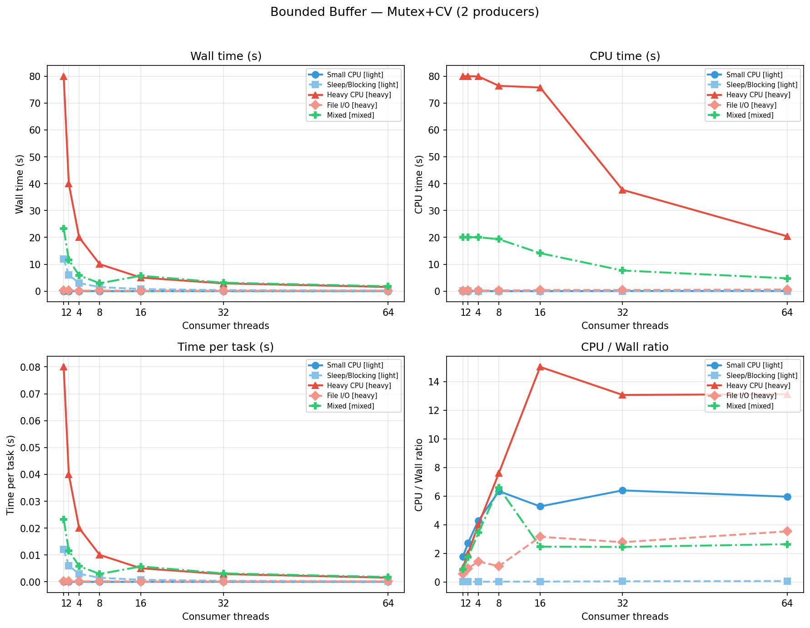
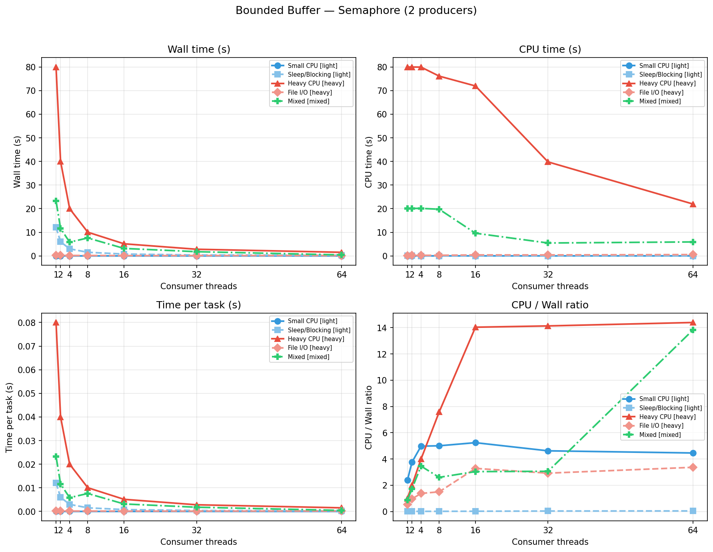
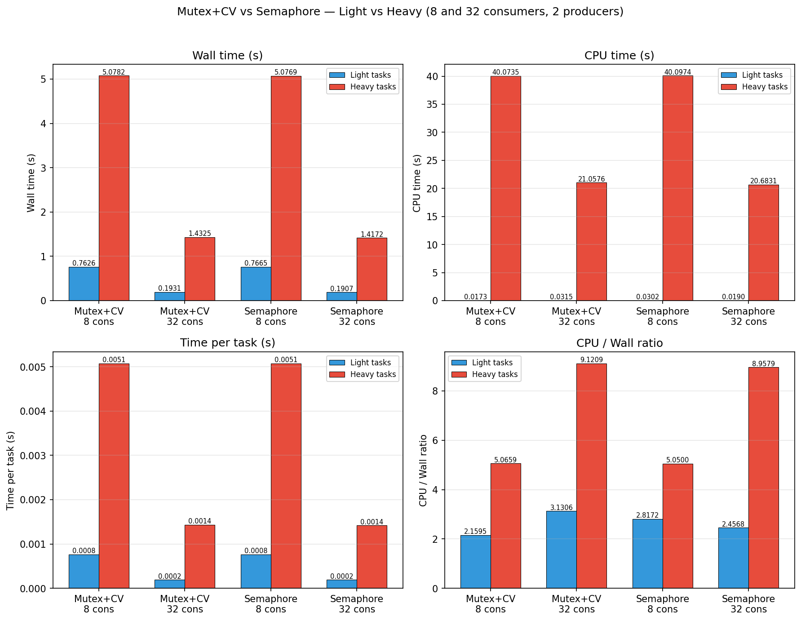
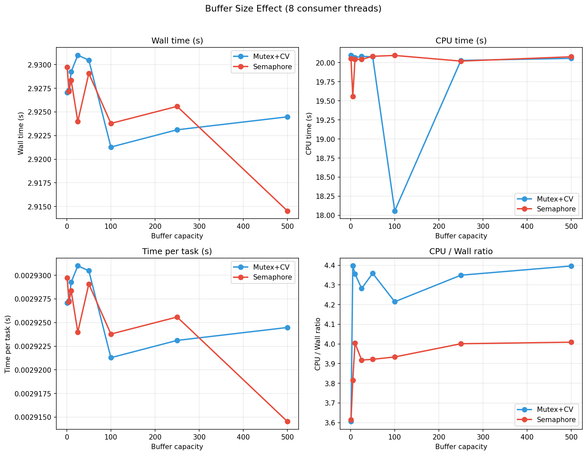

# Bounded Buffer

A thread-safe bounded buffer (producer–consumer queue) in C with two backends: **mutex + condition variable** and **POSIX semaphore**. The buffer has a fixed capacity — producers block when the buffer is full, and consumers block when it is empty.

## Architecture

- **Producer thread:** Creates tasks and pushes them into the buffer via `bb_push`. Blocks when the buffer reaches capacity. Calls `terminate()` after enqueuing all tasks.
- **Consumer threads:** Pop tasks via `bb_pop` and execute them in parallel. Block when the buffer is empty. Exit cleanly when `bb_pop` returns `NULL` (buffer terminated and drained).
- **Buffer:** A linked-list queue protected by either mutex+CV or semaphores, with a capacity limit enforced at enqueue time.

### Task Types

| Type | Name     | Description                                 |
| ---- | -------- | ------------------------------------------- |
| 1    | Small    | Light CPU work (~100 iterations).           |
| 2    | Heavy    | CPU-bound busy loop (~80 ms).               |
| 3    | File I/O | Create temp file, write, read back, unlink. |
| 4    | Blocking | Sleeps for 10 ms.                           |
| 0    | Mixed    | 250 of each of the above (1000 total).      |

### Implementations

- **`boundedBuffer_mutex_cv.c`** — Mutex + two condition variables (`not_empty`, `not_full`). Producers wait on `not_full` when the buffer is at capacity; consumers wait on `not_empty` when the buffer is empty. `terminate()` broadcasts on both CVs so all blocked threads wake up and exit.

- **`boundedBuffer_semaphore.c`** — POSIX named semaphores (`empty_slots` initialized to capacity, `filled_slots` initialized to 0) plus a mutex for linked-list access. Producers `sem_wait(empty_slots)` before enqueue and `sem_post(filled_slots)` after; consumers do the reverse. Termination uses a cascade: `terminate()` posts to `filled_slots`, the first consumer to wake with an empty buffer re-posts and returns `NULL`, propagating the wake-up to all consumers.

### Metrics Collected

- **time_takenMonotonic** — Wall-clock time (seconds).
- **time_takenProcess** — Process CPU time (seconds), sum over all threads.
- **time_takenPerTask** — Wall time per task (monotonic / task count).
- **cpuTimeVsWallTime** — Ratio of CPU time to wall time (> 1 with many threads).

---

## How to Run

### Build and run the benchmark

**Option A — Shell script (Mutex+CV, 16 consumers):**

```bash
cd boundedBuffer
./main.sh
```

**Option B — Manual build and run:**

```bash
cd boundedBuffer

# Mutex+CV
gcc -o main_cv main.c boundedBuffer_mutex_cv.c producer_consumer.c tasks.c task.c -lpthread
./main_cv [num_consumers] [buffer_capacity]

# Semaphore
gcc -o main_sem main.c boundedBuffer_semaphore.c producer_consumer.c tasks.c task.c -lpthread
./main_sem [num_consumers] [buffer_capacity]
```

- **Arguments:** Defaults to 4 consumers and buffer capacity 100. Pass 1–64 for consumers.
- **Output:** For each task type (Small, Heavy, File I/O, Blocking, Mixed), the program prints the four metrics above.

### Generate graphs

Requires Python 3 with `matplotlib` and `numpy`:

```bash
pip install matplotlib numpy
```

- **Mutex+CV metrics (1–64 threads)**

  ```bash
  python3 plot_metrics.py
  ```

  Builds `main_cv`, runs all thread counts, plots four metrics → `graphs/metrics_plot_cv.png`

- **Semaphore metrics (1–64 threads)**

  ```bash
  python3 plot_metrics_sem.py
  ```

  Builds `main_sem`, runs all thread counts → `graphs/metrics_plot_sem.png`

- **Mutex+CV vs Semaphore comparison (8 and 32 threads)**

  ```bash
  python3 compare_cv_sem.py
  ```

  Builds both binaries, runs at 8 and 32 threads → `graphs/compare_cv_sem_8_32.png`

- **Buffer size effect (1–500 capacity, 8 threads)**

  ```bash
  python3 plot_buffer_size.py
  ```

  Runs both implementations across buffer sizes → `graphs/buffer_size_effect.png`

All plots are saved under the `graphs/` directory.

---

## Graphs and Inferences

### 1. Mutex+CV: metrics vs thread count



**Inferences:**

- **Wall time** drops sharply from 1 to 8 threads (~23s → ~3s) as consumers parallelize the workload. Returns diminish beyond 16 threads, plateauing below 1s.
- **CPU time** also decreases from ~20s (1 thread, dominated by the Heavy workload running serially) to ~6s at 64 threads, as more cores share the work and blocking tasks waste less CPU.
- **Time per task** mirrors wall time — falling from ~23ms to sub-1ms, reflecting improved throughput.
- **CPU/wall ratio** rises from ~0.8 (single-threaded, lots of sleeping) to ~5.5 at 64 threads. Values > 1 confirm true parallel CPU utilization. The ratio keeps climbing at high thread counts since more threads overlap CPU work.

---

### 2. Semaphore: metrics vs thread count



**Inferences:**

- The curves are nearly identical to mutex+CV. Both implementations provide equivalent throughput and scaling.
- **Wall time** shows the same sharp drop from 1→8 threads and plateau beyond 16.
- **CPU/wall ratio** at 64 threads reaches ~6, slightly higher than mutex+CV. The semaphore's `sem_wait`/`sem_post` path has fractionally less overhead than the CV path for waking threads, leading to marginally more efficient CPU usage at extreme thread counts.
- The semaphore implementation avoids the need for `pthread_cond_broadcast` on termination — instead using a lightweight chain-wake pattern through `sem_post`.

---

### 3. Mutex+CV vs Semaphore comparison (8 and 32 threads)



**Inferences:**

- **Wall time** drops significantly from 8 to 32 threads for both implementations, showing expected throughput improvement from higher consumer parallelism.
- **CPU time** stays close between Mutex+CV and Semaphore at the same thread count, indicating both execute essentially the same total work.
- **Time per task** is much lower at 32 threads than 8 threads for both implementations; the improvement is primarily from increased overlap of heavy tasks.
- **CPU/wall ratio** increases at 32 threads because the same CPU work is compressed into less wall time; any small difference between implementations is synchronization overhead, not algorithmic behavior.

---

### 4. Buffer size effect (8 consumer threads)



**Inferences:**

- **Wall time** and **time per task** are remarkably stable across buffer sizes from 1 to 500. The Heavy task type dominates the total runtime (~80ms per task), making synchronization overhead negligible regardless of buffer size.
- **CPU time** shows a dip around buffer_size=100 for the semaphore implementation, likely due to reduced contention when the buffer is large enough to rarely block the producer.
- **CPU/wall ratio** for the semaphore version starts lower at very small buffers (~3.6) and stabilizes around 4.0. The mutex+CV version starts higher (~4.4) and stays relatively flat. This reflects how small buffers force frequent blocking/waking, and the semaphore handles that transition more efficiently.
- Overall, buffer capacity has minimal impact on throughput when it is at least ~10. Very small buffers (1–5) introduce extra blocking overhead but do not significantly degrade wall time because the workload itself is the bottleneck.

---

## Summary

| Graph                     | Content                                    | Main Takeaway                                                                                          |
| ------------------------- | ------------------------------------------ | ------------------------------------------------------------------------------------------------------ |
| `metrics_plot_cv.png`     | Mutex+CV, 4 metrics vs thread count        | Wall time drops sharply up to 8–16 threads; CPU/wall ratio confirms true parallelism.                  |
| `metrics_plot_sem.png`    | Semaphore, 4 metrics vs thread count       | Nearly identical scaling to mutex+CV; semaphore reaches slightly higher CPU efficiency at 64 threads.  |
| `compare_cv_sem_8_32.png` | Mutex+CV vs Semaphore at 8 and 32 threads  | Both scale strongly from 8 to 32 consumers; implementation differences remain small vs workload effects. |
| `buffer_size_effect.png`  | Both impls across buffer sizes 1–500       | Buffer size has negligible impact on throughput; workload duration dominates over sync overhead.        |
