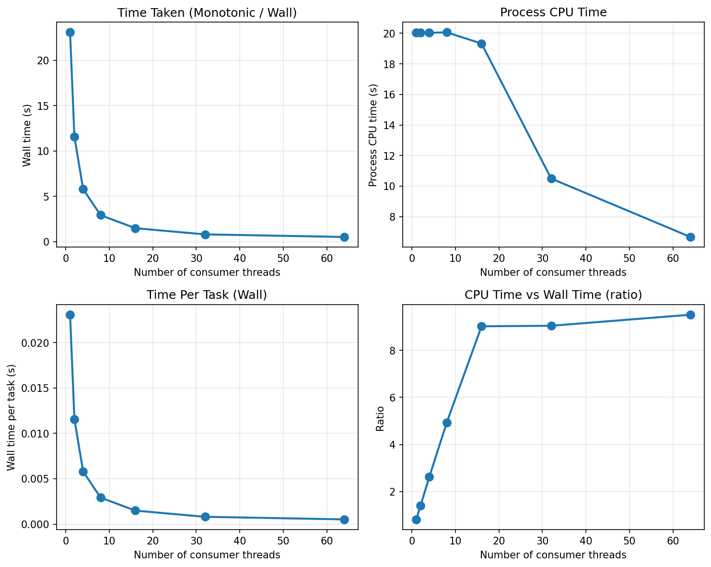
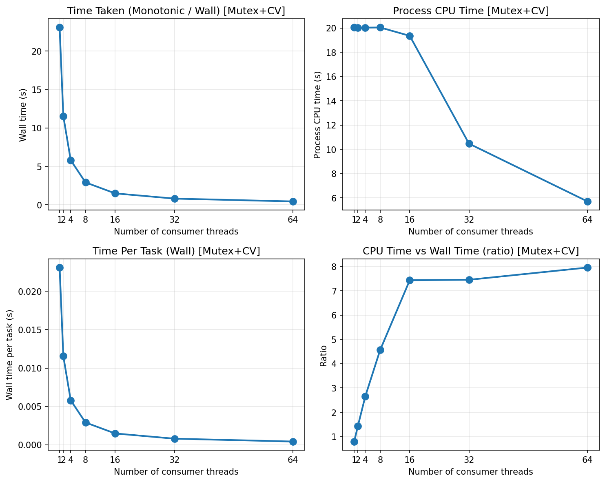
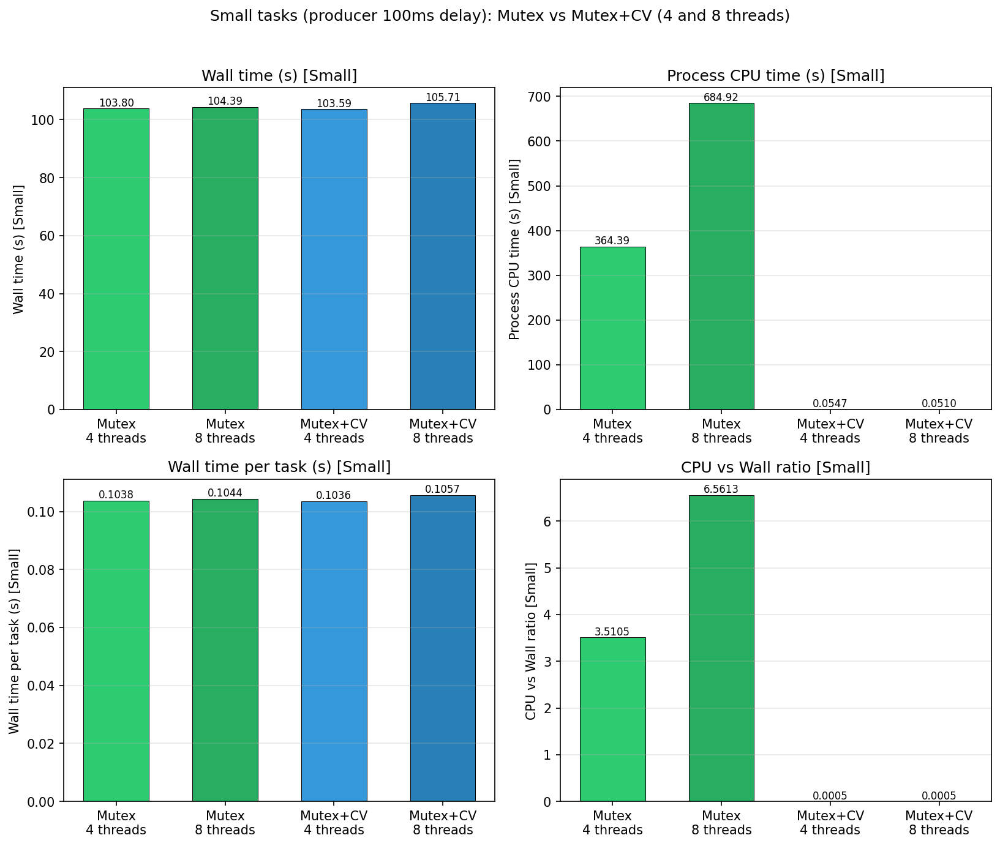

# Thread Pool

A multi-threaded task queue in C with **producer–consumer** workers. The pool can be built with two backends: **mutex-only** (busy polling when the queue is empty) or **mutex + condition variable** (threads block until work arrives).

## Description

### Architecture

- **Producer thread:** Enqueues tasks into a shared linked-list queue. Tasks are identified by type (1–4 or mixed).
- **Consumer threads:** Dequeue tasks and run `task_func(args)` in parallel. You choose the number of consumer threads (1–64).
- **Queue:** Protected by a mutex; the CV variant also uses a condition variable so consumers sleep when the queue is empty instead of spinning.

### Task Types

| Type | Name     | Description                                  |
| ---- | -------- | -------------------------------------------- |
| 1    | Small    | Light CPU work (~100 iterations).            |
| 2    | Heavy    | CPU-bound busy loop (~80 ms).                |
| 3    | File I/O | Create temp file, write, read back, unlink.  |
| 4    | Blocking | Sleeps for 10 ms.                            |
| 0    | Mixed    | 250 of each of the above (1000 tasks total). |

### Implementations

- **`threadPool_mutex.c`** — Mutex-only. Consumers loop and call `dequeue_task`; if the queue is empty they get `NULL` and continue looping (busy wait).
- **`threadPool_mutex_cv.c`** — Mutex + condition variable. Consumers block in `pthread_cond_wait` when the queue is empty; `enqueue_task` signals and `terminate_thread_pool` broadcasts so they exit cleanly.

### Metrics Collected

- **time_takenMonotonic** — Wall-clock time (seconds).
- **time_takenProcess** — Process CPU time (seconds), sum over all threads.
- **time_takenPerTask** — Wall time per task (monotonic / task count).
- **cpuTimeVsWallTime** — Ratio of CPU time to wall time (e.g. &gt; 1 with many threads).

---

## How to Run

### Build and run the benchmark

**Option A — Shell script (Mutex+CV, 16 consumers):**

```bash
cd threadPool
./main.sh
```

This compiles `main` with `threadPool_mutex_cv.c` and runs `./main 16`.

**Option B — Manual build and run:**

```bash
cd threadPool

# Mutex+CV (recommended)
gcc -o main main.c threadPool_mutex_cv.c consumer.c tasks.c -lpthread
./main [num_consumer_threads]   # e.g. ./main 4  or  ./main 8

# Mutex-only
gcc -o main main.c threadPool_mutex.c consumer.c tasks.c -lpthread
./main [num_consumer_threads]
```

- **Arguments:** `./main` uses 4 consumers by default. `./main N` uses `N` consumer threads (1–64).
- **Output:** For each task type (Small, Heavy, File I/O, Blocking, Mixed), the program prints the four metrics above.

### Generate graphs

Requires Python 3 with `matplotlib` and `numpy`:

```bash
pip install matplotlib numpy
```

- **Mutex-only metrics (1, 2, 4, 8, 16, 32, 64 threads)**  
  Builds `main` with mutex, runs all thread counts, plots four metrics → `graphs/metrics_plot.png`

  ```bash
  python3 plot_metrics.py
  ```

- **Mutex+CV metrics (same thread counts)**  
  Builds `main_cv` with mutex+CV, runs all thread counts → `graphs/metrics_plot_cv.png`

  ```bash
  python3 plot_metrics_cv.py
  ```

- **Compare Mutex vs Mutex+CV (4 and 8 threads)**  
  Builds both binaries, runs each with 4 and 8 consumers, plots comparison (Mixed or Small tasks depending on `main.c`) → `graphs/compare_mutex_cv.png`

  ```bash
  python3 compare_mutex_cv.py
  ```

All plots are written under the `graphs/` directory.

---

## Graphs and Inferences

### 1. Mutex-only: metrics vs thread count



**What it shows:** Wall time, CPU time, time per task, and CPU/wall ratio for the **mutex-only** implementation, averaged over all five task types, for 1, 2, 4, 8, 16, 32, and 64 consumer threads.

**Inferences:**

- **Wall time (monotonic):** Often decreases as threads increase (up to a point), then can level off or increase due to contention and overhead.
- **CPU time:** Tends to grow with more threads (more cores doing work); can exceed wall time (ratio &gt; 1) when multiple threads run in parallel.
- **Time per task:** Reflects throughput; lower is better. Improves with more consumers until the queue is drained quickly and producer or synchronization becomes the bottleneck.
- **CPU vs wall ratio:** &gt; 1 indicates good parallel CPU use; very high values can mean a lot of spinning (e.g. mutex-only consumers busy-waiting when the queue is empty).

---

### 2. Mutex+CV: metrics vs thread count



**What it shows:** Same four metrics for the **mutex+condition variable** implementation over the same thread counts.

**Inferences:**

- **Compared to mutex-only:** With CV, consumers block when the queue is empty instead of spinning, so **CPU time** and **CPU/wall ratio** are typically lower when the workload is bursty or the queue is often empty.
- **Wall time:** Can be similar or slightly better than mutex-only when there are many threads, because less CPU is wasted on busy-waiting.
- **Scalability:** Both implementations scale with thread count for CPU-bound (e.g. Heavy) and mixed workloads; CV usually scales more efficiently in terms of CPU usage when the queue is frequently empty.

---

### 3. Mutex vs Mutex+CV comparison (4 and 8 threads)



**What it shows:** Side-by-side comparison of the four metrics for **4 and 8 consumer threads**, Mutex vs Mutex+CV. The plot may use **Mixed** tasks (250 of each type) or **Small** tasks only, depending on how `main.c` is configured (e.g. with or without producer delay).

**Inferences:**

- **Wall time:** Mutex+CV can be similar or slightly better when consumers would otherwise spin; with a slow producer (e.g. 100 ms delay per enqueue), CV avoids burning CPU while waiting.
- **CPU time:** Usually **lower for Mutex+CV** because waiting threads block instead of looping on `dequeue_task`.
- **Time per task:** Reflects how quickly the workload is finished; comparison shows whether CV improves or matches throughput for 4 vs 8 threads.
- **CPU vs wall ratio:** Lower for Mutex+CV when the queue is often empty, indicating better CPU efficiency and less busy-wait.

---

## Future Improvements

- 1️⃣ Batch dequeue
- 2️⃣ Node freelist (avoid malloc)
- 3️⃣ Per-thread queues

That will dramatically improve small-task scaling.

## Summary

| Graph                  | Content                               | Main takeaway                                                                         |
| ---------------------- | ------------------------------------- | ------------------------------------------------------------------------------------- |
| `metrics_plot.png`     | Mutex-only, 4 metrics vs thread count | Throughput and CPU use as you add threads; busy-wait can inflate CPU time.            |
| `metrics_plot_cv.png`  | Mutex+CV, 4 metrics vs thread count   | Same metrics with blocking wait; typically better CPU efficiency when queue is empty. |
| `compare_mutex_cv.png` | Mutex vs Mutex+CV at 4 and 8 threads  | CV reduces CPU usage (and often improves or matches wall time) by avoiding busy-wait. |

To regenerate any graph, run the corresponding Python script from the `threadPool` directory after installing `matplotlib` and `numpy`.
